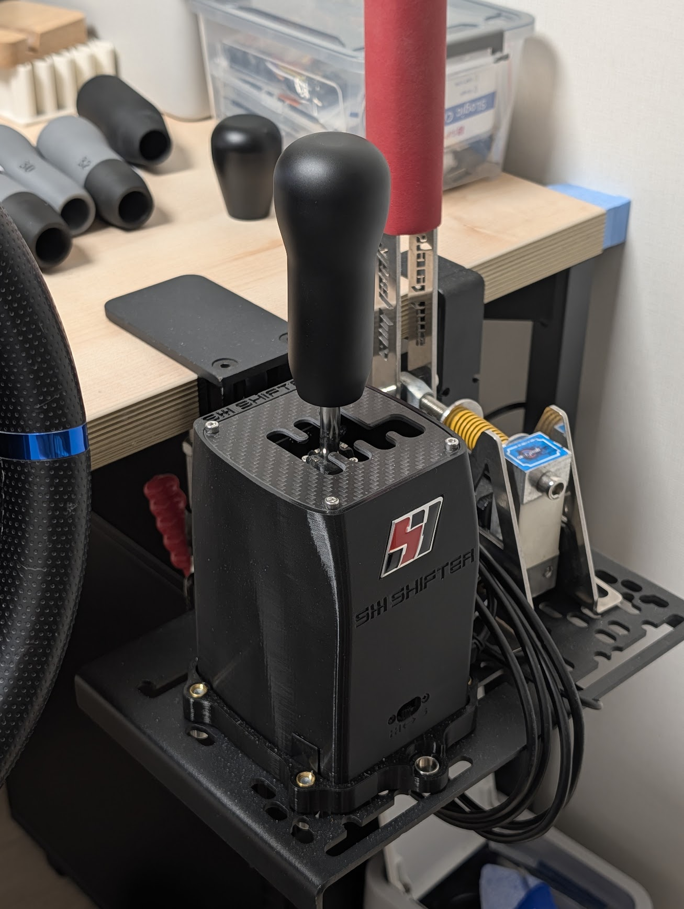

Hybrid knob for SHH shifter
===

## Motivation

I have a [SHH SHIIFTER HUBB](https://www.shiftershh.com/en/home/26-144-shh-shifter-hubb.html), and bought a [short knob](https://www.shiftershh.com/en/home/28-ShortKnob.html) for the H-shifter mode and a [long knob](https://www.shiftershh.com/en/home/29-LongKnob.html) for the sequential shifter mode.

They are good knobs, but I felt it's tedious to switch between every mode change. So I've made a hybrid knob.

## How To

### Aluminium CNC

1. Download `knob.FCStd` file.
2. (Optional) Adjust `VarSet.Diameter` for the shaft diameter to your taste (default=32mm).
3. Export the model and the technical drawing in appropriate formats (e.g. STEP and PDF).
4. Sand blasting and hardcoat annodizing were applied for the finishing.

### 3D Print

1. Download `knob-3dp.FCStd` file.
2. (Optional) Adjust `VarSet.Diameter` for the shaft diameter to your taste (default=32mm).
3. (Optional) Adjust `VarSet.ThreadClearance` to your 3D print's parameter.
4. Export the model in an appropriate format.
5. Print with appropriate parameters.
